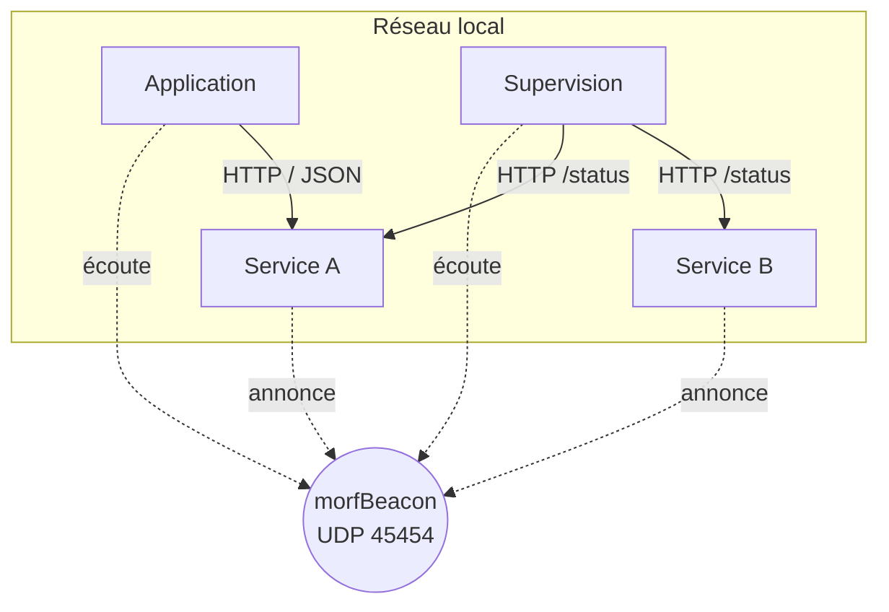

# L'architecture de morfSystem

Ce document est la **carte** de l'écosystème.

Il décrit comment les pièces s'assemblent.

La [philosophie](PHILOSOPHY.md) explique *pourquoi* l'architecture est ainsi.

Ce document explique *comment* elle est faite.

Les deux se complètent.

---

# Une forme sans centre

morfSystem n'a pas de serveur principal.

Pas de maître.

Pas de contrôleur.

Tous les composants sont des pairs.

Chacun est responsable de son propre domaine.

Chacun peut fonctionner seul.

La coopération est un choix, jamais une obligation.



Un composant **annonce** sa présence.

Les autres **écoutent**.

Puis ils dialoguent directement, en HTTP, lorsqu'ils y trouvent un intérêt.

---

# Les familles de composants

Le classement ci-dessous n'introduit aucune hiérarchie.

Il aide seulement à situer un composant.

## Les services

Ils portent une responsabilité précise et l'exposent, en général via une API HTTP.

Ils annoncent leur présence via morfBeacon.

## Les applications

Elles répondent à un besoin métier de l'utilisateur.

Elles peuvent s'appuyer sur des services, tout en restant autonomes.

## Les composants embarqués

Ils tournent sur des plateformes contraintes, comme les ESP32.

Ils produisent ou collectent une information, en respectant les mêmes contrats.

## Les outils

Ils accompagnent le cycle de vie des projets (installation, déploiement, diagnostic).

Ils ne participent pas au fonctionnement quotidien des services.

> La liste des composants existants vit dans l'[écosystème](ECOSYSTEM.md).

---

# Comment un composant se décrit

Un composant doit pouvoir répondre à trois questions, sans qu'on ait à le configurer :

- **Qui suis-je ?** (nom, machine, version)
- **Est-ce que je fonctionne ?** (état de santé)
- **Que sais-je faire ?** (capacités)

Ces réponses reposent sur **deux canaux complémentaires**, définis par le protocole morfBeacon :

1. un **heartbeat UDP**, périodique et minimal, qui annonce la *présence* ;
2. un **endpoint HTTP `/status`**, interrogé à la demande, qui donne le *détail*.

La présence est diffusée souvent, donc elle reste courte.

Le détail est lu rarement, donc il peut être riche.

Cette séparation est ce qui permet au protocole de rester stable tout en laissant les services s'enrichir.

---

# Comment les composants collaborent

La collaboration repose sur des **contrats**, jamais sur la connaissance du fonctionnement interne d'autrui.

Un contrat peut être une API HTTP, un format JSON, un protocole réseau ou un fichier d'échange.

Trois règles encadrent tout échange :

- **la découverte se cherche par capacité, pas par nom** : un service se reconnaît à ce qu'il sait faire, car son nom peut changer ;
- **la donnée a un seul propriétaire** : les autres la consultent, la copient, l'enrichissent, sans jamais en devenir propriétaires ;
- **une dépendance est toujours optionnelle** : l'absence d'un composant retire une possibilité, jamais le fonctionnement de base.

> Le détail des contrats et de leur cycle de vie vit dans [CONTRACTS.md](CONTRACTS.md).

---

# Où vivent les données

Chaque service est propriétaire de ses données et les range selon une convention commune (`config/`, `data/`, `cache/`, `logs/`, `tmp/`).

Une application cliente ne possède pas de données métier : elle délègue la persistance aux services.

Cette convention permet à un administrateur de retrouver immédiatement la nature de chaque fichier, quel que soit le service.

> La convention complète vit dans [FILESYSTEM.md](FILESYSTEM.md).

---

# Comment un composant est déployé

Le déploiement suit lui aussi des conventions communes, pour qu'un composant s'installe de la même façon partout.

- Un binaire s'installe dans son propre dossier (`/opt/<service>` sous Linux).

- Sa configuration vit à l'endroit attendu par l'administrateur (`/etc/<service>` sous Linux).

- Un point d'entrée unique gère l'installation, la mise à jour et la désinstallation, quel que soit le gestionnaire de services (systemd, Planificateur de tâches Windows, launchd).

- Chaque port HTTP est **réservé à l'avance** dans un registre d'adressage unique, pour que deux services n'entrent jamais en collision.

Concrètement, sur une machine Linux :

```
/opt/<service>/           # le binaire et ses ressources
├── <exécutable>
├── data/                 # données dont le service est propriétaire (à sauvegarder)
├── cache/                # données reconstructibles (jetables)
├── logs/                 # journaux du service
└── tmp/                  # fichiers temporaires

/etc/<service>/           # la configuration, là où un administrateur la cherche
└── <service>.json
```

> Le rôle de chaque répertoire est détaillé dans [Gestion des données locales](FILESYSTEM.md).

Le registre d'adressage réserve un port par service, une fois pour toutes :

```
service          port HTTP
---------------  ---------
morfBeacon       8787
morfSensor       8788
morfNotify       8789
morfMonitor      8790
morfDashboard    8791
...              ...
```

Ce registre, comme les autres conventions techniques, est tenu par morfTools.

---

# morfTools : la gouvernance technique

morfTools occupe une place à part : **aucun composant n'en dépend pour fonctionner**.

Dès que plusieurs projets sont installés, il devient le garant de leur cohérence.

Il connaît les ports réservés, les dépôts officiels, les copies vendorées, les mécanismes de déploiement et les règles de mise à jour.

Son outil de diagnostic, `doctor`, ne se contente pas de détecter des erreurs : il repère les **écarts** entre un système réel et les conventions de l'écosystème.

morfTools ne pilote jamais les services.

Il préserve leur cohérence.

---

# Un exemple de bout en bout

Prenons une application d'analyse qui souhaite exploiter les mesures d'un capteur.

1. Le service **capteur** démarre et annonce sa présence (heartbeat morfBeacon).

2. L'**application** écoute les annonces et repère un service annonçant la capacité recherchée.

3. Elle lit son `/status` pour connaître son API, puis l'interroge en **HTTP**.

4. Le capteur reste **propriétaire** de ses mesures ; l'application ne fait que les consulter et les enrichir.

5. Un outil de **supervision** observe les deux, sans jamais leur donner d'ordre.

Aucune adresse n'a été configurée.

Aucun composant n'était indispensable à l'autre.

Retirer l'un n'aurait pas cassé l'autre.

C'est le comportement nominal de morfSystem.

---

# Ce que cette architecture garantit

- **Autonomie** : chaque composant vaut quelque chose seul.

- **Évolutivité** : ajouter un composant ne modifie aucun autre.

- **Robustesse** : la panne d'un composant ne se propage pas.

- **Durabilité** : les technologies peuvent changer, les contrats restent.

---

# Pour aller plus loin

- [Philosophie](PHILOSOPHY.md) : pourquoi cette architecture.

- [Principes d'architecture](ARCHITECTURE-PRINCIPLES.md) : les règles de conception, une par une.

- [Les contrats](CONTRACTS.md) : le langage commun des composants.

- [Gestion des données locales](FILESYSTEM.md) : où et comment les données sont rangées.

- [Écosystème](ECOSYSTEM.md) : les composants existants et leurs responsabilités.

- [Gouvernance](GOVERNANCE.md) : comment la cohérence est préservée dans le temps.

- [Glossaire](GLOSSARY.md) : les termes clés employés dans cette documentation.
