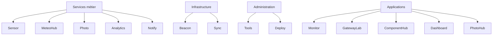

# L'écosystème morfSystem

morfSystem n'est pas constitué d'une application unique.

Il est composé d'un ensemble de projets indépendants, chacun possédant sa propre responsabilité.

Cette séparation n'est pas une contrainte technique.

Elle constitue le fondement même de l'architecture.

Chaque projet doit pouvoir évoluer, être remplacé ou disparaître sans remettre en cause le fonctionnement global de l'écosystème.

Les projets collaborent.

Ils ne se possèdent jamais.

---

# Une responsabilité, un dépôt

Chaque dépôt Git représente une responsabilité.

Jamais une fonctionnalité.

Cette nuance est importante.

Une fonctionnalité peut évoluer.

Une responsabilité doit rester stable.

Ainsi, lorsqu'un nouveau besoin apparaît, la première question n'est jamais :

> "Dans quel projet vais-je ajouter cette fonctionnalité ?"

La première question est :

> "À quelle responsabilité appartient-elle ?"

La réponse détermine naturellement le projet concerné.

Si aucune responsabilité existante ne correspond, un nouveau projet peut être créé.

---

# Les familles de projets

Les composants de morfSystem peuvent être regroupés en plusieurs familles.

Cette classification n'introduit aucune hiérarchie.

Elle facilite simplement la compréhension de l'écosystème.

---

# Les services métier

Les services métier produisent ou exploitent une information.

Ils répondent à un besoin fonctionnel.

Ils peuvent généralement être utilisés seuls.

## morfSensor

Acquisition des données physiques.

Capteurs environnementaux.

Présence.

Mesures.

Le projet représente la source de vérité concernant les informations qu'il produit.

---

## morfPhoto

Indexation permanente de la photothèque.

Il parcourt les dossiers autorisés et en extrait les métadonnées.

Il tient un index consultable des photos.

Il reste la source de vérité concernant la photothèque : les autres composants n'en tirent qu'une lecture.

---

## MeteoHub

Station météo autonome basée sur ESP32.

Elle produit les mesures météo.

Elle expose son historique.

Elle reste pleinement fonctionnelle sans aucun autre composant.

---

## morfAnalytics

Analyse les données produites par les autres composants.

Il ne remplace jamais la source de vérité.

Il construit une valeur supplémentaire à partir des informations existantes.

---

## morfNotify

Diffusion des notifications.

Il ne décide jamais qu'une notification doit être envoyée.

Il fournit uniquement le mécanisme de diffusion.

---

# Les services d'infrastructure

Ces composants rendent possible la coopération.

Ils n'apportent généralement aucune fonctionnalité visible à l'utilisateur.

Pourtant, ils constituent le langage commun de l'écosystème.

## morfBeacon

Découverte automatique des services.

Annonce des capacités.

Description des composants présents sur le réseau.

Il ne transporte jamais les données métier.

---

## morfSync

Synchronisation de données.

Il fournit une mécanique de synchronisation.

Il ne définit jamais le contenu synchronisé.

---

# Les applications

Certaines applications présentent ou exploitent les informations de plusieurs composants.

Elles restent néanmoins indépendantes.

## morfMonitor

Observation.

Diagnostic.

Supervision.

Il observe.

Il ne pilote jamais les autres composants.

---

## GatewayLab

Découverte et analyse réseau.

Visualisation des équipements.

Diagnostic de l'environnement réseau.

---

## ComponentHub

Gestion des composants.

Inventaire.

Documentation.

Synchronisation des bibliothèques.

---

## morfDashboard

Affichage temps réel.

Conçu principalement pour les écrans embarqués.

Il présente les informations.

Il ne produit aucune donnée.

---

## PhotoHub

Application de bureau de gestion de la photothèque.

Elle est le client de morfPhoto.

Elle présente la photothèque indexée et déclare les sélections de dossiers, dans les limites des racines autorisées.

Elle ne détient aucune donnée : morfPhoto reste la source de vérité.

Ce statut de client sans état a été validé sur plusieurs plateformes. Le même
PhotoHub tourne sous Windows et sous Linux x64. Lancé sur une autre machine que
d'habitude, il découvre le même morfPhoto par morfBeacon et retrouve exactement
l'état construit ailleurs : la photothèque, les dossiers surveillés, les racines
autorisées, l'indexation. Les chemins présentés sont ceux du serveur qui indexe,
jamais ceux de la machine qui exécute l'interface. Rien n'est à synchroniser
entre deux exemplaires de PhotoHub, parce qu'aucun des deux ne possède la
configuration : ils interrogent la même autorité.

Une application n'est pas un service administrable. PhotoHub s'annonce sur le
réseau et morfMonitor la voit, vivante et joignable, marquée **non supervisée** :
morfMonitor sait où elle tourne sans avoir à la piloter (septième principe). Il
n'existe donc ni `morf deploy PhotoHub`, ni `morf purge PhotoHub`, ni unité de
service : ces gestes appartiennent aux services administrables, pas aux
applications clientes. Le badge « non supervisé » décrit une relation, pas un
défaut.

---

# Les outils

## morfTools

morfTools occupe une position particulière.

Il ne participe pas au fonctionnement quotidien des services.

Il accompagne leur cycle de vie.

Installation.

Compilation.

Déploiement.

Diagnostic.

Mises à jour.

Validation.

Il constitue aujourd'hui la couche de gouvernance technique de morfSystem.

Cette gouvernance reste volontairement non intrusive.

Les services continuent à fonctionner sans lui.

---

## morfDeploy

Cœur de déploiement partagé du parc.

Il fournit la mécanique commune d'installation, de mise à jour et de retrait des services, à partir du descriptif de chaque projet.

Il est intégré (vendoré) dans chaque service plutôt qu'imposé comme dépendance externe : un service se déploie sans dépendre d'un dépôt distant.

Il fournit le mécanisme.

Il ne décide jamais de ce qu'un service installe.

---

# Les projets futurs

Tous les futurs projets devront respecter les principes décrits dans ce dépôt.

Ils ne seront pas évalués selon leur langage.

Ni selon leur plateforme.

Mais selon leur capacité à respecter les responsabilités existantes.

Un nouveau projet doit enrichir l'écosystème.

Jamais le compliquer.

---

# Une architecture qui accepte le changement

Le nombre de dépôts n'est pas un objectif.

Il est une conséquence.

Lorsqu'une responsabilité apparaît, un projet peut naître.

Lorsqu'une responsabilité disparaît, un projet peut être retiré.

La stabilité de morfSystem ne dépend donc pas du nombre de composants.

Elle dépend uniquement de la stabilité de ses principes d'architecture.

C'est cette philosophie qui permet à l'écosystème d'évoluer sans perdre sa cohérence.