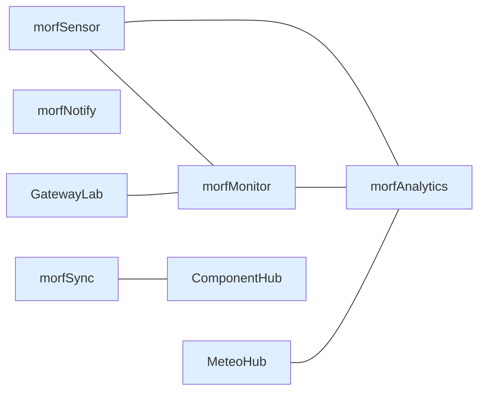

# L'architecture de morfSystem

L'architecture de morfSystem repose sur une idée simple :

> **Les composants collaborent parce qu'ils partagent des règles communes, pas parce qu'ils dépendent les uns des autres.**

Cette distinction est fondamentale.

Dans de nombreux écosystèmes, une application principale contrôle l'ensemble des composants.

Les modules deviennent rapidement dépendants d'un noyau central.

La disparition de ce noyau entraîne souvent l'arrêt complet du système.

morfSystem suit une approche différente.

Aucun composant n'occupe une position centrale.

Chaque service est responsable de son propre domaine.

La coopération apparaît naturellement grâce à des contrats communs.

Aucun composant n'est indispensable au fonctionnement des autres.

Chaque liaison représente une collaboration.

Jamais une dépendance obligatoire.

---

# Une architecture horizontale

morfSystem ne possède pas de "serveur principal".

Il ne possède pas de "master".

Il ne possède pas de "contrôleur".

Tous les composants sont des pairs.

Ils annoncent leur présence.

Ils découvrent leurs voisins.

Ils publient leurs capacités.

Ils choisissent ensuite de collaborer lorsqu'ils trouvent un service capable d'enrichir leurs propres fonctionnalités.

Cette approche permet de construire un écosystème qui grandit naturellement.

Ajouter un nouveau service n'impose aucune modification des services existants.

---

# Trois couches complémentaires

Même si les composants restent indépendants, ils peuvent être regroupés selon leur rôle.

## Les producteurs

Ils représentent la source de vérité.

Ils produisent une information.

Exemples :

- morfSensor
- MeteoHub
- GatewayLab

Ces projets ne cherchent pas à analyser leurs données.

Ils les produisent.

Ils restent responsables de leur propre métier.

---

## Les consommateurs

Ils utilisent les informations produites par les autres services.

Ils apportent de nouvelles fonctionnalités sans modifier les producteurs.

Exemples :

- morfAnalytics
- ComponentHub
- futurs services d'analyse

Ils enrichissent les données.

Ils ne les remplacent jamais.

---

## Les services transverses

Ils rendent l'écosystème plus cohérent.

Ils ne portent pas de logique métier.

Ils fournissent des services communs.

Exemples :

- morfBeacon
- morfSync
- morfNotify

Leur rôle consiste à faciliter la coopération entre les autres composants.

---

# Les applications de supervision

Certains projets n'appartiennent à aucune catégorie précédente.

Ils observent l'écosystème.

Ils ne produisent pas de données métier.

Ils ne modifient pas les autres services.

Ils permettent simplement de comprendre l'état du système.

Le meilleur exemple est morfMonitor.

Sa responsabilité est d'observer.

Jamais de contrôler.

Cette distinction explique de nombreux choix d'architecture.

morfMonitor découvre les services.

Il ne leur donne jamais d'ordre.

---

# La gouvernance

Une architecture distribuée ne signifie pas une architecture sans règles.

Au contraire.

Plus les composants sont indépendants, plus leurs conventions doivent être stables.

Cette cohérence est assurée par un ensemble de contrats communs.

Par exemple :

- découverte réseau ;
- structure des API ;
- publication des capacités ;
- conventions de configuration ;
- conventions de déploiement ;
- conventions de supervision.

Ces règles évoluent très lentement.

Les implémentations, elles, évoluent librement.

---

# morfBeacon : le langage commun

Les composants ne se recherchent pas mutuellement.

Ils annoncent simplement leur existence.

morfBeacon constitue le protocole commun de découverte.

Son rôle n'est pas de superviser.

Son rôle n'est pas de contrôler.

Il permet uniquement à un composant de dire :

> « Je suis présent, voici qui je suis, voici ce que je sais faire. »

Cette simplicité est volontaire.

Le protocole doit rester stable.

Les services, eux, peuvent évoluer.

---

# morfTools : la gouvernance de l'écosystème

morfTools occupe une place particulière.

Il ne fait pas partie du fonctionnement normal des services.

Aucun composant n'a besoin de morfTools pour fonctionner.

En revanche, dès que plusieurs projets morfSystem sont installés, morfTools devient le garant de leur cohérence.

Il connaît :

- les ports réservés ;
- les conventions communes ;
- les dépôts officiels ;
- les copies vendorées ;
- les mécanismes de déploiement ;
- les règles de mise à jour ;
- les outils de diagnostic.

Il ne remplace jamais les services.

Il orchestre leur cycle de vie.

Cette différence est essentielle.

morfTools ne cherche pas à contrôler l'écosystème.

Il cherche à préserver sa cohérence.

---

# Une architecture conçue pour durer

Les technologies évolueront.

Les bibliothèques évolueront.

Les systèmes d'exploitation évolueront.

Les cartes électroniques évolueront.

La philosophie, elle, doit rester stable.

C'est pourquoi morfSystem cherche toujours à séparer :

- les responsabilités ;
- les contrats ;
- les implémentations.

Lorsqu'une implémentation change, le contrat reste identique.

L'écosystème continue alors à fonctionner sans rupture.

C'est cette stabilité des interfaces qui permet à morfSystem d'évoluer progressivement sans remettre en cause les composants déjà existants.